# Image Classification using ResNet50 pre-trained weights and web frontend
By Hide Inada

If you are a photographer, you may have seen AI-enabled auto-classification for tagging a photo when you upload a photo to a stock photo agency.
If you want to build a basic version of an AI image classification system using the classes contained in pretrained weights, you can do it with very little code.

I implemented one that classifies a photo into 1000 classes. I used Keras team's implementation of [ResNet50](https://github.com/keras-team/keras-applications/blob/master/keras_applications/resnet50.py) as the ML backend with pre-trained weights and used Flask as the web frontend.
ResNet50 model with pre-trained weights has 74.9% accuracy according to [a Keras's web page](https://keras.io/applications/) for predicting the top 1 object in a photo.

To test the performance of the system, I ran sample photos by the system to see how it classifies. Please see the result at the end of this article.

## Deployed Instance
I deployed an instance on AWS and it is available for you to check out:

[http://ec2-3-83-93-180.compute-1.amazonaws.com:5000/](http://ec2-3-83-93-180.compute-1.amazonaws.com:5000/)

### How to use the deployed instance
When you access the above URL, you should see the below screen:
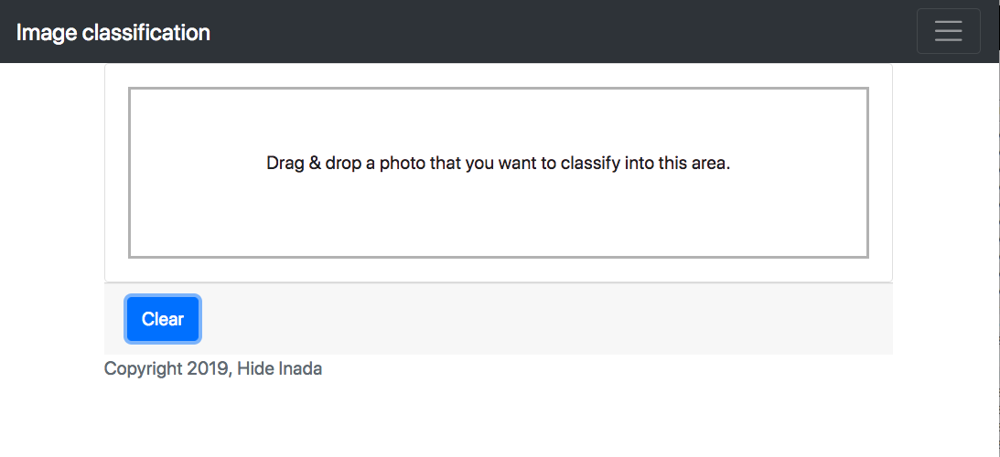	

Drag & drop a photo from your file manager (e.g. Finder) into the rectangular area.  Once the photo is dropped, it automatically uploads the image to my AWS instance for classification.  Once classification is done, top 3 classes the system predicted will be returned on the same page so there is no need for you to do anything else.  If you want to try classifying more images, just hit the "Clear" button.

## Code
Entire code is checked in [https://github.com/hideyukiinada/ic/tree/master/web_app](https://github.com/hideyukiinada/ic/tree/master/web_app)

The key part of the code is a section that loads the ResNet50 model and predicts classes:
[https://github.com/hideyukiinada/ic/blob/master/web_app/__init__.py](https://github.com/hideyukiinada/ic/blob/master/web_app/__init__.py)

The code is so short, and you may think "is this it?" ;-)

## Accuracy assessment with samples images
I used the photos from my portfolio to test how the classifier classifies my photos.

### Success cases
Classification for exotic animals and some household items worked well:

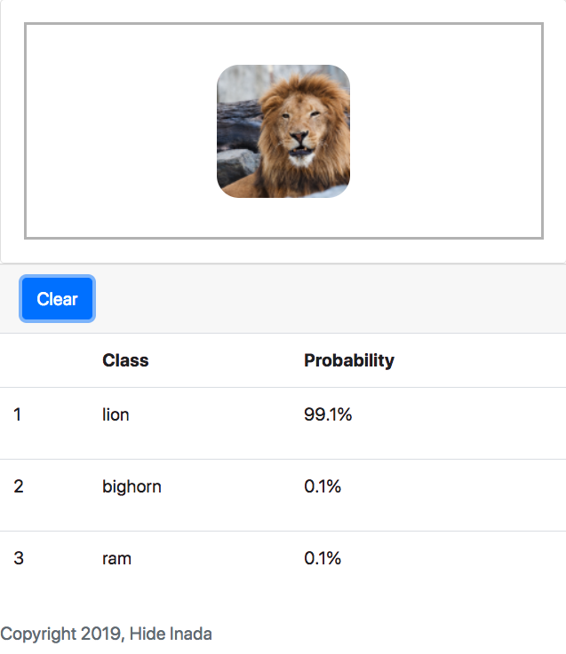	
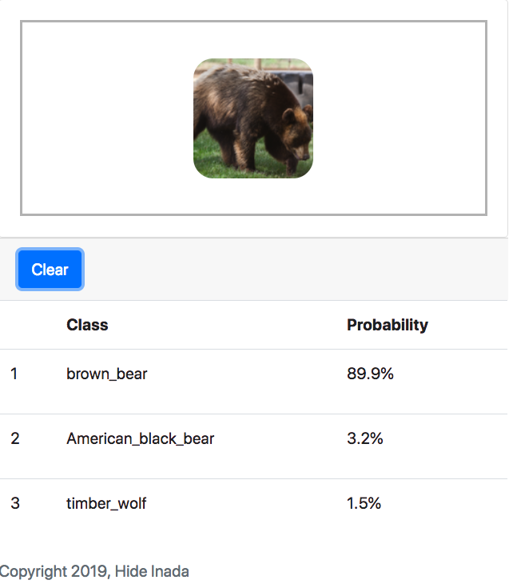
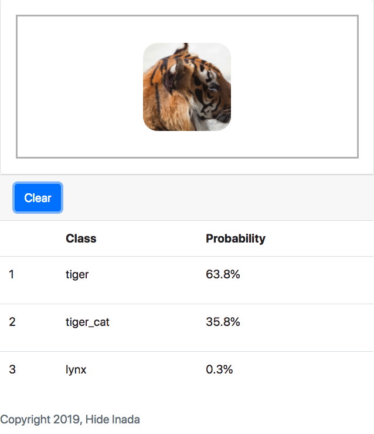
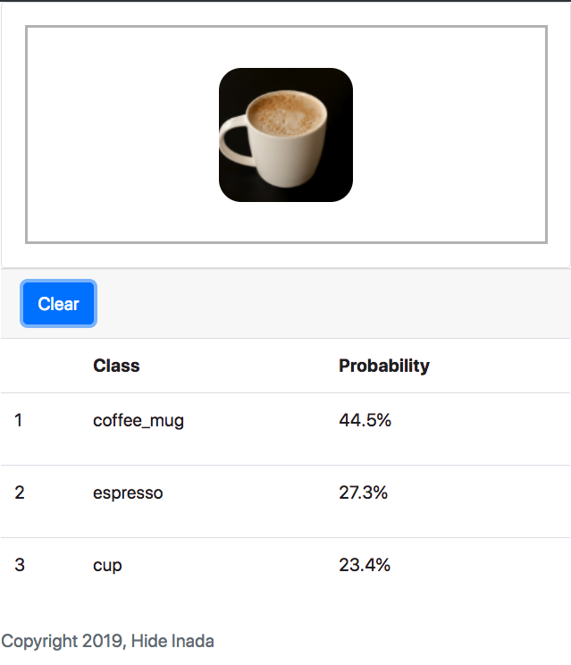
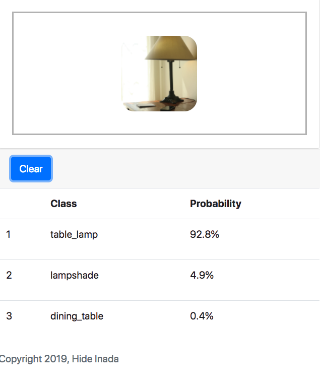	
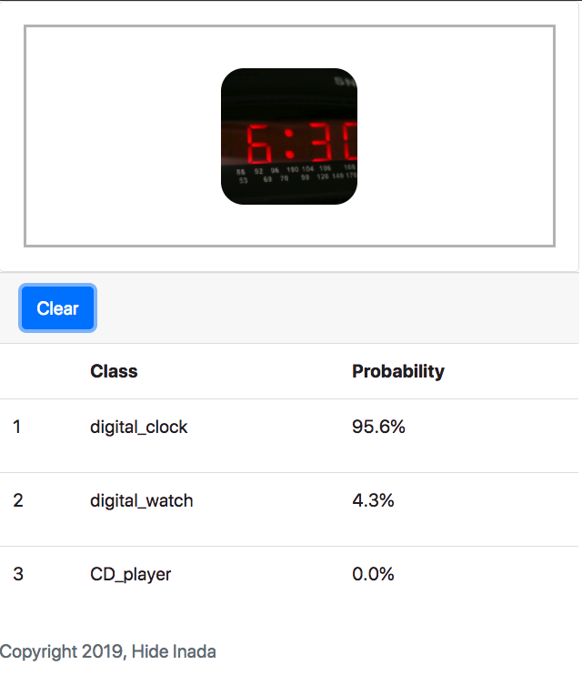	
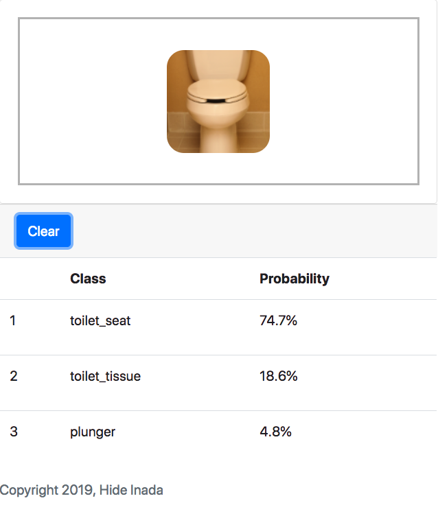  

### Borderline case
The below sign is a street sign, but a human would have classified this as a speed limit sign.
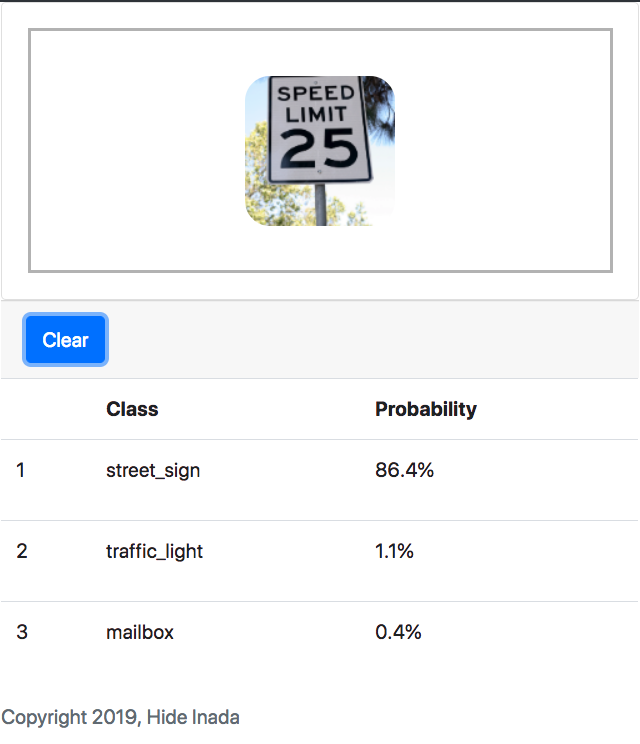

### Incorrect cases
This is a picture of Sacramento River, but the system classified as the lakeside.  I think in this case, human would have guessed 
correctly because you can see the other side of the river, which would not be the case for a lake.

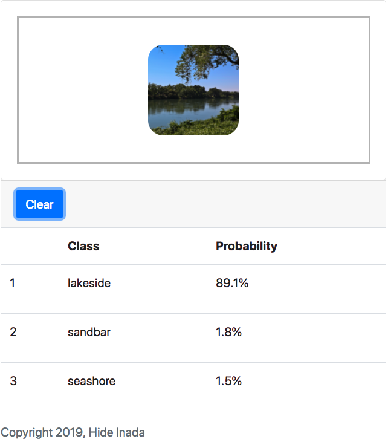

The below picture has a flower, but the flower does not appear in the top 3. The vase does not have a narrow stem like a goblet, so the goblet is not right. A beaker would be wider than this. It still lists a vase on #3, so there is some hope.

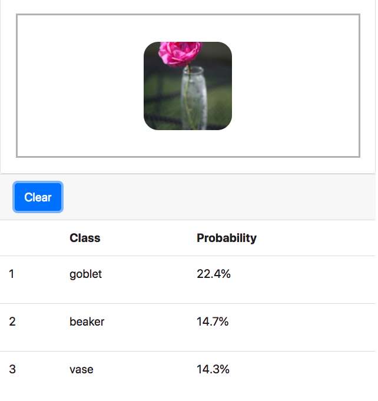

